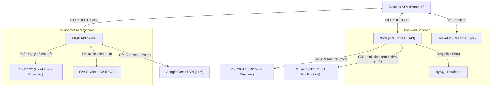
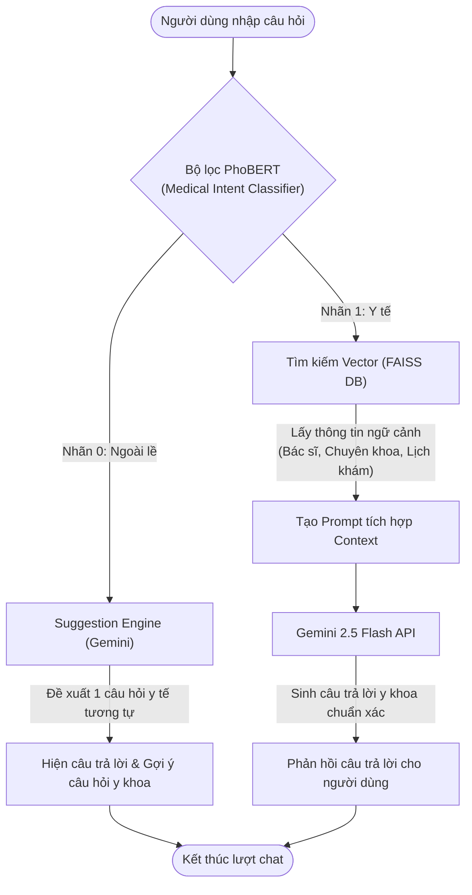

# Medical Appointment System

Hệ thống đặt lịch khám bệnh trực tuyến toàn diện, bao gồm Backend (Node.js & Express), Frontend (React) và Chatbot hỗ trợ.

## 🌟 Tổng quan dự án

Dự án này được thiết kế để quản lý việc đặt lịch khám, hồ sơ bệnh nhân, và hỗ trợ tư vấn qua chatbot. Hệ thống cung cấp giao diện cho cả Bệnh nhân, Bác sĩ và Quản trị viên.

---

## 🗺️ Sơ đồ kiến trúc & Luồng hoạt động

### 1. Sơ đồ kiến trúc hệ thống (System Architecture)
Sự tương tác giữa Client, Backend Services, AI Service và các dịch vụ bên thứ ba (Third-party APIs):



### 2. Luồng xử lý của Chatbot AI (RAG & Classification Pipeline)
Quy trình lọc câu hỏi không liên quan đến y tế và xử lý RAG trước khi gửi tới Gemini:



---

Để xem chi tiết và đầy đủ **10 luồng nghiệp vụ toàn hệ thống** (bao gồm luồng Đăng nhập JWT, đặt lịch, xác thực email, thanh toán VietQR, chat realtime Socket.io, đồng bộ Vector DB FAISS, khảo sát sức khỏe...), vui lòng truy cập tài liệu:

👉 **[Sơ đồ 10 luồng nghiệp vụ hệ thống (System Workflows)](docs/workflows.md)**

---

## 🏗️ Cấu trúc thư mục

Dự án được cấu trúc theo mô hình Microservices/Monorepo phân tách rõ ràng các thành phần Client, Backend API và AI Service:

```text
medical-appointment-system/
├── backend/                  # Node.js Backend API (Express & Sequelize)
│   ├── src/
│   │   ├── config/           # Cấu hình Database & App
│   │   ├── controllers/      # Hàm xử lý request (User, Doctor, Patient...)
│   │   ├── middleware/       # Middleware xác thực JWT, phân quyền RBAC
│   │   ├── models/           # Định nghĩa các Model Sequelize (Booking, Doctor...)
│   │   ├── services/         # Logic nghiệp vụ (Gửi email, thanh toán VietQR...)
│   │   ├── socket/           # Xử lý đặt lịch thời gian thực (Socket.io)
│   │   └── route/            # Định nghĩa các đầu Endpoint API
│   └── package.json
├── frontend/                 # React.js Client SPA
│   ├── src/
│   │   ├── components/       # Các Component dùng chung (Header, Footer...)
│   │   ├── containers/       # Các trang quản trị & người dùng (System, Patient, Doctor)
│   │   ├── store/            # Quản lý State toàn cục bằng Redux (Actions, Reducers)
│   │   └── utils/            # Các hàm tiện ích & Hằng số
│   └── package.json
└── chatbot/                  # Python Flask Service (AI Chatbot RAG)
    ├── app/                  # Chứa các Route API của Chatbot
    ├── core/                 # Pipeline xử lý RAG & Phân loại câu hỏi
    │   ├── classifier/       # Bộ lọc PhoBERT nhận diện câu hỏi y khoa
    │   ├── data/             # WebDataManager đồng bộ dữ liệu từ Node.js sang FAISS
    │   ├── llm/              # Kết nối với Gemini API
    │   └── vector_store/     # Quản lý Vector DB FAISS & Embeddings
    ├── finetune_phobert.py   # Script huấn luyện PhoBERT (Colab/Local GPU)
    ├── medical_dataset.csv   # Dữ liệu 2.800 mẫu tiếng Việt dùng để train PhoBERT
    ├── main.py               # Điểm khởi chạy của Flask Server
    └── requirements.txt      # Danh sách thư viện Python cần thiết
```

## 🚀 Hướng dẫn nhanh

Để chạy toàn bộ hệ thống, bạn cần khởi động cả Backend NodeJS, Frontend và Chatbot:

### 1. Khởi động Backend (Node.js & Express)
Vào thư mục `backend` và làm theo các bước:
- Cần cài đặt: Node.js, MySQL.
- Lệnh: `npm install` && `npm run dev`.
- Chạy tại: `http://localhost:6969`.

### 2. Khởi động Frontend (React.js)
Vào thư mục `frontend` và làm theo các bước:
- Cần cài đặt: Node.js, npm/yarn.
- Lệnh: `npm install` && `npm start`.
- Chạy tại: `http://localhost:3000`.

### 3. Khởi động Chatbot (Python Flask)
Vào thư mục `chatbot` và làm theo các bước:
- Cần cài đặt: Python 3.8+, PyTorch, FAISS.
- Lệnh: `pip install -r requirements.txt` && `python main.py`.
- Chạy tại: `http://localhost:5002`.

## 🛠️ Công nghệ sử dụng

- **Frontend**: React.js, Redux, SCSS, Bootstrap.
- **Backend**: Node.js, Express.js, Sequelize ORM.
- **Database**: MySQL.
- **AI & Chatbot**: Python Flask, PhoBERT, FAISS Vector DB, Gemini API.
- **Khác**: Socket.io (Đồng bộ thời gian thực), Nodemailer (Gửi email đơn thuốc PDF), VietQR API (Tạo mã QR thanh toán).

---
*Developed with ❤️ by TranXuanDucIT*