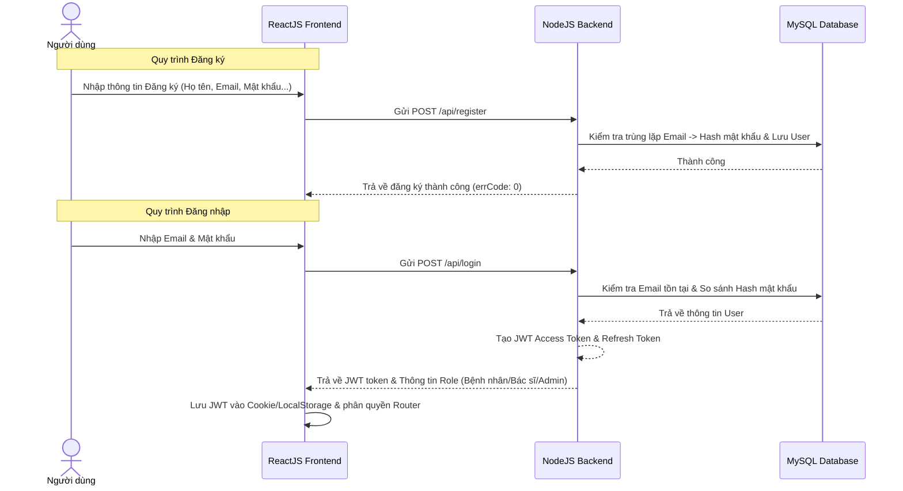
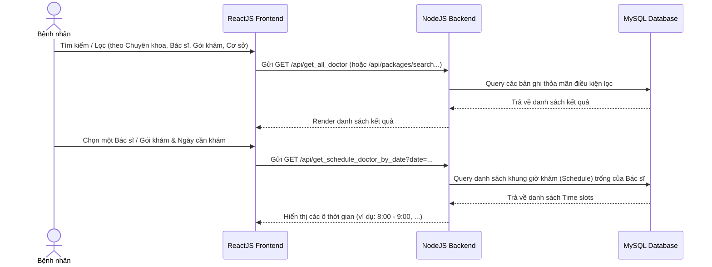
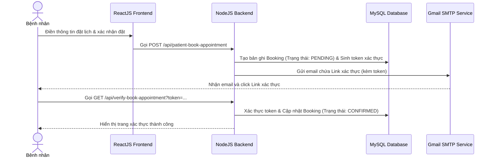
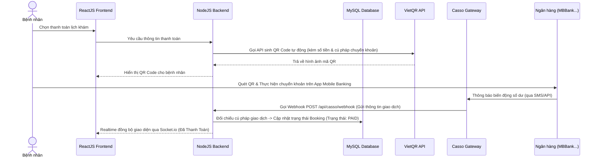
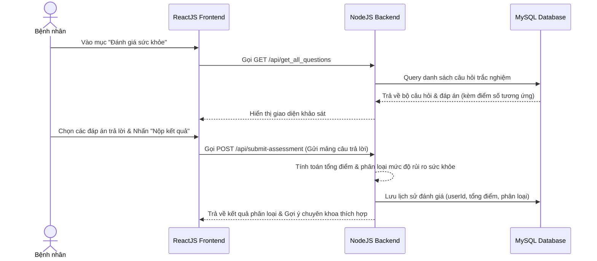
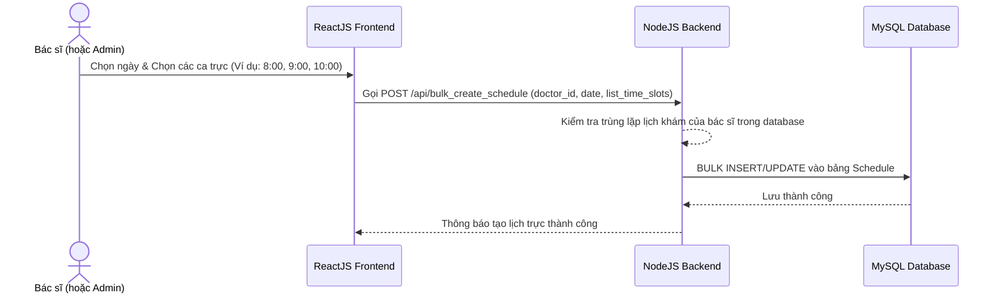
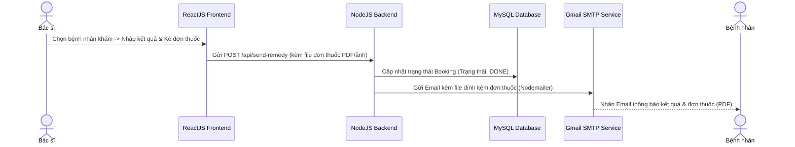
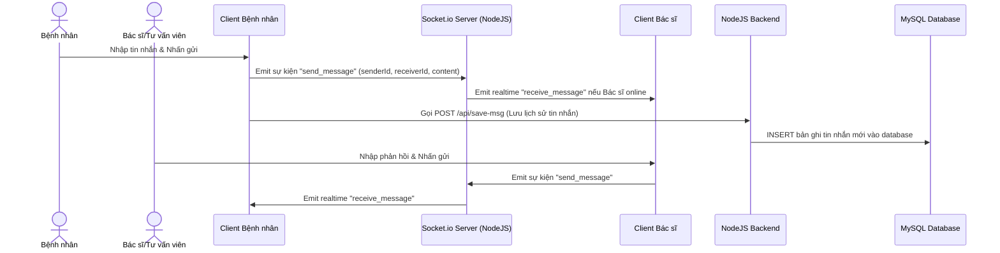
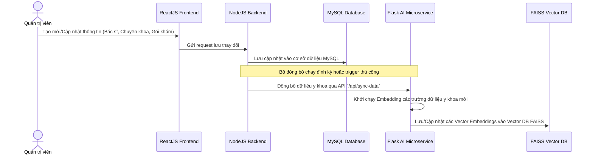

# 🔄 Các luồng nghiệp vụ chi tiết (System Workflows)

Tài liệu này mô tả chi tiết tất cả các luồng nghiệp vụ và luồng dữ liệu (Data & Logic flows) trong **Hệ thống đặt lịch khám bệnh trực tuyến (Medical Appointment System)**.

---

## 👥 I. Nhóm Bệnh nhân (Patient Workflows)

### 1. Đăng ký & Đăng nhập (Authentication & Authorization)
Mô tả quy trình đăng ký tài khoản bệnh nhân mới và đăng nhập nhận JWT để phân quyền truy cập.



### 2. Tìm kiếm & Đặt lịch khám (Search & Booking)
Mô tả cách bệnh nhân tìm kiếm/lọc chuyên khoa, bác sĩ, gói dịch vụ và chọn khung giờ đặt lịch.



### 3. Luồng Đặt lịch & Xác thực qua Email (Booking Verification)
Quy trình gửi email kích hoạt lịch hẹn để tránh tình trạng đặt lịch ảo.



### 4. Tự động hóa Thanh toán VietQR & Casso Webhook (VietQR Payment Flow)
Luồng thanh toán tự động, nhận dữ liệu giao dịch thời gian thực và đồng bộ Socket.io lên màn hình Client.



### 5. Khảo sát & Đánh giá sức khỏe (Health Assessment Flow)
Bệnh nhân trả lời bộ câu hỏi trắc nghiệm để nhận đánh giá rủi ro tim mạch/tiêu hóa sơ bộ và gợi ý chuyên khoa phù hợp.



---

## 🩺 II. Nhóm Bác sĩ (Doctor Workflows)

### 6. Đăng ký Ca trực hàng loạt (Bulk Schedule Creation)
Bác sĩ hoặc Admin đăng tải lịch làm việc của bác sĩ theo ngày và các ca trực.



### 7. Khám bệnh & Gửi đơn thuốc điện tử (Prescription / Remedy Flow)
Bác sĩ hoàn tất khám và tải lên đơn thuốc/hóa đơn để gửi tự động cho bệnh nhân qua email.



---

## 💬 III. Nhóm Giao tiếp Realtime (Real-time Messaging)

### 8. Chat Real-time giữa Bệnh nhân và Bác sĩ/Tư vấn viên (Socket.io Chat)
Quy trình trao đổi trực tuyến và lưu trữ lịch sử tin nhắn.



---

## 🤖 IV. Nhóm Trí tuệ nhân tạo (AI Chatbot Flows)

### 9. Luồng xử lý Chatbot AI (PhoBERT Classifier + FAISS + Gemini RAG)
Cách hệ thống lọc ý định câu hỏi y học và truy xuất tài liệu trước khi trả lời.

```mermaid
mermaid
graph TD
  Start(["Người dùng nhập câu hỏi"]) --> PhoBERT{"Bộ lọc PhoBERT<br>(Medical Intent Classifier)"}
  
  %% Lộ trình không liên quan y tế
  PhoBERT -->|Nhãn 0: Ngoài lề| Suggest["Suggestion Engine (Gemini)"]
  Suggest -->|Đề xuất 1 câu hỏi y tế tương tự| Output0["Hiện câu trả lời & Gợi ý câu hỏi y khoa"]

  %% Lộ trình y tế
  PhoBERT -->|Nhãn 1: Y tế| VectorSearch["Tìm kiếm Vector (FAISS DB)"]
  VectorSearch -->|"Lấy thông tin ngữ cảnh<br>(Bác sĩ, Chuyên khoa, Lịch khám)"| Context["Tạo Prompt tích hợp Context"]
  Context --> GeminiLLM["Gemini 2.5 Flash API"]
  GeminiLLM -->|"Sinh câu trả lời y khoa chuẩn xác"| Output1["Phản hồi câu trả lời cho người dùng"]

  Output0 --> End(["Kết thúc lượt chat"])
  Output1 --> End
```

### 10. Luồng Đồng bộ dữ liệu Y tế sang FAISS Vector DB (AI Data Sync Flow)
Tự động đồng bộ các thay đổi nghiệp vụ (Bác sĩ mới, Gói khám mới...) sang Vector DB để làm giàu tri thức Chatbot.


